{.w-30.mt--10.mb-5}

---
title: About me
layout: image-right
image: ./nirtamir.png
---

# Nir Tamir

- Senior Frontend developer
- Loves open source and tooling
- <mdi-web /> [nirtamir.com](https://nirtamir.com)

<!--
Before we dive in, let me introduce myself. I'm Nir Tamir, a senior frontend developer passionate about open source and tooling. I work with early-stage startups, helping them leverage cutting-edge technologies like AI.
-->

---
layout: section
---
# Why 3D?

<div v-click class="text-2xl">Because it makes people go “whoa.”</div>

---

# What We Think 3D Is

- Math.
- Shaders.
- Game engines.
- Too complicated.

---

# ✅ It’s True...

3D can be complex.

But not always.

---

# Let's start

---

# Three.js

- A JavaScript library for creating 3D graphics in the browser.

---

# Hello World

```tsx
export default function App() {
  return (
    <Canvas>
      <mesh>
        <boxGeometry />
        <meshStandardMaterial />
      </mesh>
    </Canvas>
  )
}
```

---

# Under the hood

```tsx
const scene = new THREE.Scene()
const camera = new THREE.PerspectiveCamera(75, width / height, 0.1, 1000)

const renderer = new THREE.WebGLRenderer()
renderer.setSize(width, height)
// document.querySelector("#canvas-container").appendChild(renderer.domElement);

const mesh = new THREE.Mesh()
mesh.geometry = new THREE.BoxGeometry()
mesh.material = new THREE.MeshStandardMaterial()

scene.add(mesh)

function animate() {
  requestAnimationFrame(animate)
  renderer.render(scene, camera)
}

animate()
```
