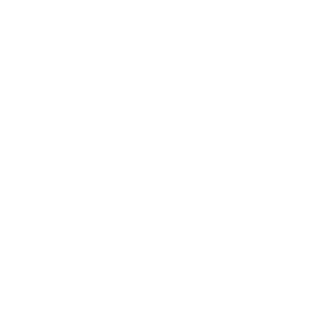

{.w-30.mt--10.mb-5}

<!--
Effortless 3D with react-three-fiber
-->

---
layout: center
---

# Effortless 3D with react-three-fiber

---
layout: section
---

# The WOW effect

<div v-click class="text-2xl">We feel that someone cares about us</div>
<div v-click class="text-xl pt-4 opacity-75">Worth it every time</div>

<!--
The wow effect.

[PAUSE]

This is the moment we are using a website and say: 'This is great!'

It comes from small things:
- A micro-interaction
- A smooth transition
- Some illustrations

[click]

Those small details create magic.

Worth it every time

We feel that someone cares about our user experience.
So we trust the project.
-->

---
layout: section
---

# 3D

<div class="text-2xl">3D is one of the fastest ways to create that wow effect</div>
<div v-click class="text-xl pt-4 opacity-75">It’s visual, it’s interactive, and it immediately grabs attention
</div>

<!--
3D is one of the fastest ways to create that wow effect.

It’s visual, it’s interactive, and it immediately grabs attention.

Even a simple 3D touch can make your product stand out
-->

---

# Wow effect examples

<div class="block -z-10">
<div class="flex items-center size-full justify-center ">
<v-switch>
<template #1>
<SlidevVideo loop autoplay>
  <source src="/vercel-ship-lanyard-drop-video.mp4" type="video/mp4" />
  <p>
    Your browser does not support videos. You may download it
    <a href="/vercel-ship-lanyard-drop-video.mp4">here</a>.
  </p>
</SlidevVideo>
</template>
<template #2>
<SlidevVideo loop autoplay>
  <source src="/iphone.mp4" type="video/mp4" />
  <p>
    Your browser does not support videos. You may download it
    <a href="/iphone.mp4">here</a>.
  </p>
</SlidevVideo>

</template>
<template #3>
<SlidevVideo loop autoplay>
  <source src="/resend.mp4" type="video/mp4" />
  <p>
    Your browser does not support videos. You may download it
    <a href="/resend.mp4">here</a>.
  </p>
</SlidevVideo>
</template>
</v-switch>
</div>
</div>

---
layout: section
---

# 3D is for everyone

<div class="text-2xl">Let’s make something that wows</div>

<!--
But 3D isn’t just for experts — it’s a creative tool anyone can use.

In this talk, we’ll build 3D web together experiences step by step, even if you’ve never touched 3D before.
-->

---
title: "About me"
layout: intro
glowSeed: 15
glowOpacity: 0.3
class: pl-25
---

# Nir Tamir

- Senior Frontend developer
- Loves open source and tooling
- <mdi-web /> [nirtamir.com](https://nirtamir.com)
<!-- - <mdi-github /> [@nirtamir2](https://github.com/nirtamir2) -->
- <mdi-twitter /> [@NirTamir](https://twitter.com/NirTamir)
<!-- - <mdi-linkedin /> [@nirtamir2](https://linkedin.com/in/nirtamir2) -->

<!--
My name is Nir. Nir Tamir.
I've been doing frontend for over a decade.
You can find more about me at nirtamir.com.
-->

---
layout: section
---

# Three.js

{.w-30.absolute}

A JavaScript library for creating 3D graphics in the browser

<!--
We are going to use Three.js - which is a JavaScript library for creating 3D graphics in the browser.
-->

---

<div v-drag="[166,69,679,458]" class="border-2 border-white rounded relative">
<div class="absolute -top-8 left-0"> 
<span class="text-2xl font-semibold">  
Renderer (WebGLRenderer)
</span>  
</div>
</div>

<span v-drag="[488,47,351,20]" class="text-sm opacity-75 pl-2" v-click>rendering your 3D scene in the browser using WebGL</span>

<div class="border-2 border-white rounded relative" v-drag="[209,129,594,355]"  v-click >
<div class="absolute -top-8 left-0"> 
<span class="text-2xl font-semibold">  
Scene
</span>
 </div>
 </div>

<span v-drag="[290,106,144,40]" v-click class="text-sm opacity-75">the stage to play</span>

 <svg v-click title="light" v-drag="[478,172,40,50]" width="31" height="46" viewBox="0 0 31 46" fill="none" xmlns="http://www.w3.org/2000/svg">
<path d="M0 30.121C0 38.694 6.72999 45.644 15.031 45.644C23.332 45.644 30.062 38.694 30.062 30.121C30.062 26.244 28.685 22.699 26.41 19.978L23.122 14.019C22.264 12.429 21.945 11.402 20.506 11.402H9.786C8.347 11.402 7.92299 12.483 7.16899 14.019L3.65199 19.978C1.37699 22.699 0 26.244 0 30.121Z" fill="#FFE46A"/>
<path d="M29.132 28.23C29.132 37.09 22.454 44.412 13.785 45.586C14.218 45.624 14.652 45.644 15.086 45.644C23.387 45.644 30.117 38.694 30.117 30.121C30.117 27.299 29.387 24.654 28.114 22.375C28.773 24.206 29.132 26.177 29.132 28.23Z" fill="#FFF0B7"/>
<path d="M0 30.087C0 33.158 0.863989 36.02 2.35399 38.43C2.03499 37.171 1.873 35.878 1.873 34.58C1.873 24.38 11.75 16.072 24.088 15.736L23.123 13.985C22.264 12.395 21.945 11.369 20.506 11.369H9.786C8.347 11.369 7.924 12.45 7.17 13.985L3.65199 19.945C1.37699 22.665 0 26.21 0 30.087Z" fill="#FFDA00"/>
<path d="M8.71199 27.456C8.69799 27.469 8.683 27.481 8.668 27.495C8.396 27.756 8.172 28.171 8.36 28.556C9.129 30.136 11.482 30.637 13.196 30.114C13.283 30.088 13.367 30.059 13.449 30.028C14.383 30.573 15.542 30.704 16.574 30.376C16.696 30.338 16.816 30.292 16.933 30.24C17.498 30.57 18.159 30.735 18.817 30.671C20.195 30.538 21.393 29.42 21.63 28.059L21.739 27.991C20.8 26.474 18.328 22.125 18.169 20.254C17.97 17.893 18.169 11.485 18.171 11.42L17 11.383C16.991 11.649 16.796 17.924 17.002 20.353C17.093 21.435 17.756 23.161 18.971 25.482C19.538 26.565 20.089 27.516 20.422 28.077C20.191 28.824 19.483 29.429 18.704 29.505C18.467 29.527 18.227 29.501 17.996 29.433C18.083 29.322 18.159 29.203 18.223 29.078C18.618 28.303 18.453 27.33 17.839 26.815C17.475 26.51 16.947 26.397 16.459 26.522C16.005 26.638 15.655 26.936 15.497 27.34C15.355 27.703 15.367 28.122 15.533 28.586C15.629 28.852 15.762 29.104 15.928 29.333C15.486 29.419 15.03 29.394 14.599 29.261C14.767 29.068 14.895 28.853 14.979 28.62C15.159 28.122 15.08 27.53 14.771 27.075C14.506 26.683 14.102 26.45 13.663 26.436C13.648 26.435 13.634 26.435 13.619 26.435C13.235 26.435 12.87 26.6 12.588 26.903C12.256 27.259 12.087 27.754 12.136 28.226C12.167 28.526 12.274 28.82 12.446 29.092C11.251 29.309 10.082 28.905 9.57599 28.292C9.88199 27.785 10.508 26.719 11.156 25.481C12.371 23.161 13.034 21.435 13.125 20.352C13.331 17.924 13.136 11.649 13.127 11.383L11.956 11.42C11.958 11.485 12.158 17.892 11.958 20.254C11.815 21.938 9.79799 25.629 8.71199 27.456ZM16.589 27.766C16.616 27.696 16.719 27.665 16.75 27.657C16.872 27.626 17.01 27.649 17.086 27.712C17.282 27.877 17.325 28.259 17.179 28.546C17.131 28.638 17.07 28.723 16.998 28.798C16.841 28.619 16.716 28.414 16.636 28.192C16.572 28.01 16.554 27.855 16.589 27.766ZM13.445 27.702C13.479 27.666 13.549 27.605 13.625 27.607C13.706 27.61 13.77 27.687 13.801 27.733C13.898 27.876 13.929 28.077 13.877 28.222C13.817 28.389 13.7 28.526 13.564 28.636C13.413 28.465 13.32 28.281 13.302 28.105C13.288 27.971 13.345 27.809 13.445 27.702Z" fill="#FAAF63"/>
<path d="M9.295 8.756H20.822C21.467 8.756 21.994 8.228 21.994 7.584V6.905C21.994 6.26 21.467 5.733 20.822 5.733H17.099C18.21 5.32 19.382 4.338 19.382 3.199V2.742C18.491 1.74 17.661 0 16.081 0H13.943C12.698 0 11.814 1.344 10.736 2.742V3.199C10.736 4.338 11.855 5.32 12.938 5.733H9.295C8.651 5.733 8.12399 6.26 8.12399 6.905V7.584C8.12399 8.228 8.651 8.756 9.295 8.756Z" fill="#6B83A5"/>
<path d="M8.468 8.756H21.649C22.294 8.756 22.821 9.283 22.821 9.928V10.607C22.821 11.251 22.294 11.779 21.649 11.779H8.468C7.823 11.779 7.29599 11.251 7.29599 10.607V9.928C7.29599 9.283 7.823 8.756 8.468 8.756ZM9.15199 3.881V4.561C9.15199 5.205 9.67899 5.732 10.324 5.732H19.793C20.438 5.732 20.965 5.205 20.965 4.561V3.881C20.965 3.237 20.438 2.709 19.793 2.709H10.324C9.67899 2.709 9.15199 3.237 9.15199 3.881Z" fill="#ABBDDB"/>
</svg>

<svg v-click width="27" height="45" viewBox="0 0 27 45" fill="none" xmlns="http://www.w3.org/2000/svg" title="camera" v-drag="[478,372,40,63]">
<path d="M3.12099 0.777008C2.99599 1.01101 2.93599 1.27501 2.94899 1.54001C2.96099 1.80601 3.04599 2.063 3.19299 2.284L7.53699 8.81201H2.93799C2.15899 8.81201 1.41199 9.122 0.860992 9.673C0.309992 10.224 0 10.971 0 11.75V41.125C0 41.904 0.309992 42.651 0.860992 43.202C1.41199 43.753 2.15899 44.062 2.93799 44.062H23.5C24.279 44.062 25.026 43.753 25.577 43.202C26.128 42.651 26.438 41.904 26.438 41.125V11.75C26.438 10.971 26.128 10.224 25.577 9.673C25.026 9.122 24.279 8.81201 23.5 8.81201H18.91L23.263 2.284C23.421 2.041 23.503 1.75799 23.5 1.46899C23.5 1.07899 23.346 0.705993 23.07 0.429993C22.795 0.154993 22.421 0 22.031 0H4.40599C4.14199 0.002 3.883 0.0750056 3.657 0.212006C3.431 0.348006 3.24599 0.544008 3.12099 0.777008ZM23.5 11.75V41.125H2.93799V11.75H23.5ZM19.287 2.93701L15.371 8.81201H11.067L7.15999 2.93701H19.287Z" fill="white"/>
</svg>

<div  v-click v-drag="[418,267,146,53]" class="flex gap-10" >
 <svg title="mesh"   width="53" height="53" viewBox="0 0 53 53" fill="none" xmlns="http://www.w3.org/2000/svg">
<path d="M40.7436 6.08645L23.1536 1.05445C21.7786 0.664452 20.3246 0.648446 18.9416 1.01045C17.5596 1.37145 16.2986 2.09645 15.2906 3.11045L3.10859 15.2924C2.09559 16.3004 1.37059 17.5604 1.00959 18.9434C0.648587 20.3254 0.664593 21.7795 1.05459 23.1535L6.08859 40.7494C6.46159 42.0594 7.16259 43.2524 8.12659 44.2154C9.08959 45.1784 10.2826 45.8804 11.5926 46.2534L29.1856 51.2885C30.5606 51.6795 32.0156 51.6944 33.3976 51.3334C34.7806 50.9714 36.0416 50.2465 37.0496 49.2335L49.2316 37.0514C50.2446 36.0434 50.9686 34.7824 51.3296 33.4004C51.6906 32.0174 51.6756 30.5644 51.2846 29.1894L46.2516 11.5944C45.8786 10.2844 45.1766 9.09144 44.2136 8.12844C43.2506 7.16444 42.0576 6.46345 40.7476 6.09045L40.7436 6.08645Z" stroke="white" stroke-width="1.5"/>
<path d="M51.4936 32.4865L26.1676 26.1694M26.1676 26.1694L19.8506 0.844452M26.1676 26.1694L8.14359 44.1945" stroke="white" stroke-width="1.5"/>
</svg>

 <svg title="mesh" class="rotate-90" width="53" height="53" viewBox="0 0 53 53" fill="none" xmlns="http://www.w3.org/2000/svg">
<path d="M40.7436 6.08645L23.1536 1.05445C21.7786 0.664452 20.3246 0.648446 18.9416 1.01045C17.5596 1.37145 16.2986 2.09645 15.2906 3.11045L3.10859 15.2924C2.09559 16.3004 1.37059 17.5604 1.00959 18.9434C0.648587 20.3254 0.664593 21.7795 1.05459 23.1535L6.08859 40.7494C6.46159 42.0594 7.16259 43.2524 8.12659 44.2154C9.08959 45.1784 10.2826 45.8804 11.5926 46.2534L29.1856 51.2885C30.5606 51.6795 32.0156 51.6944 33.3976 51.3334C34.7806 50.9714 36.0416 50.2465 37.0496 49.2335L49.2316 37.0514C50.2446 36.0434 50.9686 34.7824 51.3296 33.4004C51.6906 32.0174 51.6756 30.5644 51.2846 29.1894L46.2516 11.5944C45.8786 10.2844 45.1766 9.09144 44.2136 8.12844C43.2506 7.16444 42.0576 6.46345 40.7476 6.09045L40.7436 6.08645Z" stroke="white" stroke-width="1.5"/>
<path d="M51.4936 32.4865L26.1676 26.1694M26.1676 26.1694L19.8506 0.844452M26.1676 26.1694L8.14359 44.1945" stroke="white" stroke-width="1.5"/>
</svg>
</div>

<!--
Most Three.js apps have the same core elements.

First we need have a Renderer that handles rendering your 3D scene in the browser using WebGL (a low-level graphics API built into browsers). (or WebGPU).

Then inside the render we have a **Scene** - which is like the stage to play -  it’s the space where all your 3D objects, lights, and cameras live.

The **Camera** is like the eyes of the viewer — it defines what part of the 3D scene is visible and how it’s projected onto the 2D screen.

Then we can have **Light** - so we won't have everything dark

and we have **Meshes** - which are the 3D object you actually see
-->

---
title: Three.js Mesh
---

<Transform v-drag="[469,239,349,326]" pos="" >
 
</Transform>

<Transform v-drag="[247,239,292,317]" pos="" >
 
</Transform>

<v-drag text-6xl pos="444,19,83,44">
Mesh
</v-drag>

<v-drag text-2xl pos="329,248,118,40">
Geometry
</v-drag>

<v-drag text-2xl pos="589,251,97,40">
Material
</v-drag>

<v-drag-arrow pos="470,100,-80,120"/>

<v-drag-arrow pos="550,100,70,120"/>

<!--
Mesh is made of:

➕ **Geometry** (the shape) -
It defines the vertices (points in space), faces (triangles built from those points) and the overall shape (cube, sphere, model...)

🎨 Material (the look)

This is the “skin” that wraps the geometry.

It controls:
    •	Color
    •	Shininess
    •	Transparency
    •	Texture maps
    •	How it reacts to light
-->

---
title: Three.js Geometries
backgroundSize: contain
---

# Geometry (shape)

- Vertices
- Faces
- Shape


<!--
- Vertices (points in space)
- Faces (triangles built from those points)
- Shape (cube, sphere, model...)
-->

---

# Material (skin)

- Color
- Shininess
- Transparency
- Texture maps
- How it reacts to light


<!--
Here on the left we have some materials that does not react to light and on the right it do affected by light. I colored the materials in green color.
-->

---

# Three.js code

```ts {1|3-5|7|9-10|12-14|16|18|all}
import * as THREE from "three";

const renderer = new THREE.WebGLRenderer({ antialias: true });
renderer.setSize(width, height);
element.append(renderer.domElement);

const scene = new THREE.Scene();

const camera = new THREE.PerspectiveCamera(75, width / height, 0.1, 1000);
camera.position.z = 2;

const geometry = new THREE.BoxGeometry(1, 1, 1);
const material = new THREE.MeshBasicMaterial({ color: "#0066CC" });
const cube = new THREE.Mesh(geometry, material);

scene.add(cube);

renderer.render(scene, camera);
```

<Transform v-drag="[750,104,167,160]" v-click>
  
  <!-- <React draggable is="ThreeBasicDemoPreview" /> -->
</Transform>

<!--
So let's see what vanilla Three.js code looks like.
[click]
First, we create a WebGLRenderer - this creates a canvas element and handles all the low-level WebGL rendering.
[click]
Then we create a Scene - think of it as a container for everything in our 3D world.
[click]
We add a PerspectiveCamera to define our viewpoint.
[click]
Finally, we create a mesh by combining a BoxGeometry with a MeshBasicMaterial.
[click]
Then we need to add the mesh to the scene
[click]
and render it with our camera
[click]
Notice how verbose this is - we'll see how R3F simplifies this in a moment.
-->

---
layout: section
---

# All that for a simple cube?

---
title: React-three-fiber
layout: section
---

# React Three Fiber (R3F)

{.w-30.absolute}

React Three Fiber is a React renderer for three.js

<!--
R3F is a React renderer for Three.js - which means it uses React's reconciliation to manage your 3D scene.
Instead of imperatively creating objects and adding them to the scene, you declare what you want using JSX.
It handles all the setup boilerplate and gives you React's component model for free.
-->

---

@@@

```tsx sandpack index=0
import { OrbitControls } from "@react-three/drei";
import { Canvas } from "@react-three/fiber";
export default function App() {
  return (
    // <Canvas> replaces all the setup code — the renderer, the scene, the render loop.
    <Canvas>
      <OrbitControls />
      <mesh>
        <boxGeometry />
        <meshMatcapMaterial color="#0066CC" />
      </mesh>
    </Canvas>
  );
}
```

```tsx sandpack index=1
import { OrbitControls } from "@react-three/drei";
import { Canvas } from "@react-three/fiber";
export default function App() {
  return (
    <Canvas>
      <OrbitControls />
      <ambientLight />
      <directionalLight position={[3, 5, 2]} />
      <mesh>
        <boxGeometry />
        <meshMatcapMaterial color="#0066CC" />
      </mesh>
    </Canvas>
  );
}

// boxGeometry, sphereGeometry, planeGeometry,
// torusGeometry, torusKnotGeometry

// meshMatcapMaterial, meshToonMaterial, meshNormalMaterial
// meshLambertMaterial, meshStandardMaterial
// metalness={0.3}
```

```tsx sandpack index=2
import { OrbitControls } from "@react-three/drei";
import { Canvas } from "@react-three/fiber";
export default function App() {
  return (
    <Canvas>
      <OrbitControls />
      <axesHelper />
      <mesh
        position={[0, 0, 0]}
        scale={[1, 1, 1]}
        rotation={[0, 0, 0]} // Math.PI / 4
      >
        <boxGeometry args={[1, 1, 1]} />
        <meshMatcapMaterial color="#0066CC" />
      </mesh>
    </Canvas>
  );
}
```

```tsx sandpack index=3 file="App.tsx"
import { OrbitControls } from "@react-three/drei";
import { Box } from "./Box";
import { Canvas } from "@react-three/fiber";
export default function App() {
  return (
    <Canvas>
      <OrbitControls />
      <Box position={[-1.2, 0, 0]} />
      <Box position={[1.2, 0, 0]} />
    </Canvas>
  );
}
```

```tsx sandpack index=3 file="Box.tsx"
import type { ThreeElements } from "@react-three/fiber";
import { useState } from "react";

export function Box(props: ThreeElements["mesh"]) {
  const [isBlue, setIsBlue] = useState(false);
  const [isLarge, setIsLarge] = useState(false);

  const color = isBlue ? "#0066CC" : "#FF5733";

  return (
    <mesh
      {...props}
      scale={isLarge ? 2 : 1}
      onClick={() => setIsLarge((isLarge) => !isLarge)}
      onPointerOver={() => setIsBlue(true)}
      onPointerOut={() => setIsBlue(false)}
    >
      <boxGeometry args={[1, 1, 1]} />
      <meshMatcapMaterial color={color} />
    </mesh>
  );
}
```

```tsx sandpack index=4 file="App.tsx"
import { OrbitControls } from "@react-three/drei";
import { Box } from "./Box";
import { Canvas } from "@react-three/fiber";
export default function App() {
  return (
    <Canvas>
      <OrbitControls />
      <Box position={[-1.2, 0, 0]} />
      <Box position={[1.2, 0, 0]} />
    </Canvas>
  );
}
```

```tsx sandpack index=4 active file="Box.tsx"
import type { ThreeElements } from "@react-three/fiber";
import { useFrame } from "@react-three/fiber";
import { useRef, useState } from "react";

export function Box(props: ThreeElements["mesh"]) {
  const meshRef = useRef<ThreeElements["mesh"]>(null!);

  useFrame((state, delta) => {
    meshRef.current.rotation.x += delta;
  });

  return (
    <mesh {...props} ref={meshRef}>
      <boxGeometry args={[1, 1, 1]} />
      <meshMatcapMaterial color="#FF5733" />
    </mesh>
  );
}
```

@@@

<!--
Here’s the same example, but written with React Three Fiber.

<Canvas> replaces all the setup code — the renderer, the scene, the render loop — it’s all handled for us.

Inside it, we add `<OrbitControls />` so the user can rotate and zoom with the mouse.

Then we create a <mesh> with a box geometry and a Matcap material, just like in Three.js, but here we write it as JSX.

[move]

I've added an axesHelper - the red line is X, green is Y, blue is Z.
Notice the mesh has position, scale, and rotation properties.
Position moves it in 3D space - [x, y, z].
Scale changes its size - [1, 1, 1] is normal size.
Rotation turns it - measured in radians, not degrees.
Play with these values to get a feel for 3D coordinates.

[click]
Now we're seeing React's real power.
I've extracted the box into its own component.
This lets us reuse it - see how we render two boxes at different positions?
The Box component also has state - it tracks hover and active states.
Click a box to scale it up. Hover to change its color.
This is the magic of R3F - 3D objects behave like React components with props, state, and events.

[click]
Let's add animation.
useFrame is R3F's animation hook - it runs every frame, about 60 times per second.
We get delta, which is the time since the last frame.
By rotating the box by delta each frame, we get smooth, frame-rate-independent animation.
The ref gives us access to the actual Three.js mesh object.
This is how you create any animation in R3F - update values in useFrame.
-->

---
layout: section
---

# What if I want something cooler than a box?

<div v-click class="text-2xl">Custom Models</div>

---

# GLTF

<BrowserWrapper title="sketchfab.com">
  <!-- <DemoIframe url="https://sketchfab.com"></DemoIframe> -->
  <a href="https://www.sketchfab.com">
  
  </a>
</BrowserWrapper>

<!--
Of course, you don't have to model everything from primitives.
You can import models created in Blender, Maya, or other 3D software.
The standard format is GLTF - think of it as the JPEG of 3D.
We can download models from the internet from websites like sketchfab for free (notice that some require some attribution).
-->

---

# So how do I use GLTF in React?

gltfJSX parses the model and generates code with all the meshes, materials, and hierarchies.

<BrowserWrapper title="gltfJSX - 🎮 Turns GLTFs into JSX components">
  <DemoIframe url="https://gltf.pmnd.rs/"></DemoIframe>
</BrowserWrapper>

<!--
After we download the models we can use the gltfjsx tool converts GLTF files into React components automatically.
It parses the model and generates code with all the meshes, materials, and hierarchies.
We can copy the code and create react components for out models.
-->

---
title: "Physics"
layout: section
---

# Physics

<div v-click class="text-2xl">
Three.js draws things — a physics library makes them act like the real world.
</div>

---
title: "Physics"
---

# Split into Physics World and View World

- **Physics World:** The Engine calculating collisions and forces
- **View World:** The Display rendering the visual output.


---
title: "Physics"
---

@@@

```tsx sandpack index=0
import { OrbitControls, Sphere, Torus } from "@react-three/drei";
import { Canvas } from "@react-three/fiber";
import { CuboidCollider, Physics, RigidBody } from "@react-three/rapier";

export default function App() {
  return (
    <Canvas>
      <OrbitControls />
      <Physics debug>
        <RigidBody colliders="cuboid">
          <mesh rotation={[Math.PI / 4, Math.PI / 4, 0]}>
            <boxGeometry />
            <meshMatcapMaterial color="#0066CC" />
          </mesh>
        </RigidBody>
        <CuboidCollider position={[0, -2, 0]} args={[20, 0.5, 20]} />
      </Physics>
    </Canvas>
  );
}
```

```tsx sandpack index=1 file="MyBox.tsx"
import {
  RapierRigidBody,
  RigidBody,
  RigidBodyProps,
} from "@react-three/rapier";
import { useRef } from "react";

export function MyBox(props: RigidBodyProps) {
  const ref = useRef<RapierRigidBody>(null!);
  return (
    <RigidBody {...props} ref={ref} colliders="cuboid">
      <mesh
        onClick={() => {
          ref.current.applyImpulse({ x: 0, y: 8, z: 0 }, true);
        }}
      >
        <boxGeometry />
        <meshMatcapMaterial color="#0066CC" />
      </mesh>
    </RigidBody>
  );
}
```

```tsx sandpack index=1 file="MySphere.tsx"
import { RigidBody, RigidBodyProps } from "@react-three/rapier";

export function MySphere(props: RigidBodyProps) {
  return (
    <RigidBody {...props} colliders="ball">
      <mesh>
        <sphereGeometry />
        <meshMatcapMaterial color="#FF5733" />
      </mesh>
    </RigidBody>
  );
}
```

```tsx sandpack index=1 file="MyTorus.tsx"
import { RigidBody, RigidBodyProps } from "@react-three/rapier";

export function MyTorus(props: RigidBodyProps) {
  return (
    <RigidBody {...props} colliders="trimesh">
      <mesh>
        <torusGeometry />
        <meshMatcapMaterial color="#50C878" />
      </mesh>
    </RigidBody>
  );
}
```

```tsx sandpack index=1 file="App.tsx"
import { OrbitControls } from "@react-three/drei";
import { Canvas } from "@react-three/fiber";
import { CuboidCollider, Physics, RigidBody } from "@react-three/rapier";
import { MyBox } from "./MyBox";
import { MySphere } from "./MySphere";
import { MyTorus } from "./MyTorus";

export default function App() {
  return (
    <Canvas>
      <OrbitControls />
      <Physics debug>
        <MyBox rotation={[Math.PI / 4, Math.PI / 4, 0]} />
        <MySphere position={[0, 10, 0]} />
        <MyTorus position={[2, 0, 0]} />
        <CuboidCollider position={[0, -2, 0]} args={[20, 0.5, 20]} />
      </Physics>
    </Canvas>
  );
}
```

@@@

<!--
Now for something really cool - physics.
React-three/rapier brings realistic physics to your 3D scenes.
Wrap objects in RigidBody components and they become physical objects.
They'll fall, collide, bounce - all automatically.

[click]

The colliders property tells Rapier the shape for collision detection.
'cuboid' for boxes, 'ball' for spheres, 'trimesh' for complex meshes.
The debug mode shows the collision shapes - turn it off for production.
Watch what happens when these objects fall and hit the ground.

[click]
Now if we change the Sphere collider to from ball to cuboid the physics engine will treat it like a cube. (DEMO)
-->

---
layout: section
---

# Key Takeaways

<v-clicks>

- The core Three.js concepts
- How R3F makes it declarative with React components
- How to add interactivity with events and state
- How to animate with `useFrame`
- How to import 3D models
- How to add physics with Rapier

</v-clicks>

---
layout: section
---

# The best way to <br> learn is by doing

<!--
Start small - make a rotating cube. [TODO: slide of just a box]
Add some interaction. [TODO: slide of just a box rotating]
Import a model and before you know it, you'll be creating those wow moments. [TODO: slide of just a rubik cube rotating]
-->

---
title: "Demo wow"
---

# Demo

<BrowserWrapper>
  <DemoIframe url="https://play.nirtamir.com"></DemoIframe>
</BrowserWrapper>

<!--
This is a model of myself that I built, using the same principles

Here's a more complete example of what you can build.
This uses everything we've covered - models, materials, physics, interactivity.
The key insight is that each of these effects is just a few lines of code.
You don't need to be a graphics programmer or a 3D artist.
You just need to understand the building blocks we've covered today.
-->

---

# Examples

<BrowserWrapper title="https://r3f.docs.pmnd.rs/getting-started/examples">
  <DemoIframe url="https://r3f.docs.pmnd.rs/getting-started/examples"></DemoIframe>
</BrowserWrapper>

<!--
You can also look at the official react-three-fiber docs - they have a lot of impressive examples you can grab and look at their code implementation
-->

---
class: flex gap-2
---

<BrowserWrapper title="Winston Snores">
  <DemoIframe url="https://winston-snores.nirtamir.com/"></DemoIframe>
</BrowserWrapper>

<BrowserWrapper title="Sky Roads">
  <DemoIframe url="https://sky-roads.nirtamir.com/"></DemoIframe>
</BrowserWrapper>

<BrowserWrapper title="Leaf Story">
  <DemoIframe url="https://leaf-story.nirtamir.com/"></DemoIframe>
</BrowserWrapper>

---
layout: section
---

# Go build stuff

<div v-click class="text-2xl">Create that wow effect</div>
<div v-click class="text-xl pt-4 opacity-75">Or at least something fun</div>

---
layout: intro
class: pb-5
glowX: 50
glowY: 120
---

<h1 class="text-4xl text-center">
Thank you!
</h1>

<div class="my-4 text-center">
<p>Slides: <b><a href="https://nirtamir.com">nirtamir.com</a></b></p>
</div>

<QRCode class="m-auto w-40 mix-blend-lighten" text="https://talks.nirtamir.com/2025/react-next/"/>

<div class="mt-8 text-sm opacity-75 text-center">
<p>Questions? Find me after or at <a href="https://nirtamir.com">nirtamir.com</a></p>
</div>

<!--
Thank you for your time!
The slides are available at nirtamir.com
I'm happy to answer questions after the talk or you can reach me through my website.
-->

---
layout: end
---
